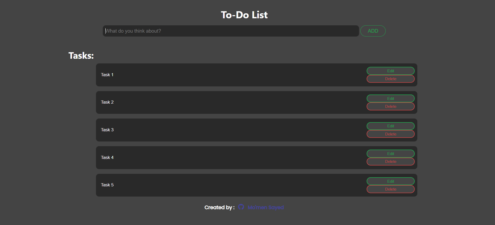

# To-Do List App

A simple yet effective to-do list application built using HTML, CSS, and JavaScript. This app allows users to add, edit, and delete tasks with data saved locally in the browser.

## 🔗 Live Demo
[Live Site](https://momen-sayed0.github.io/To-Do-List/)

## 📂 Repository
[GitHub Repository](https://github.com/momen-sayed0/To-Do-List)

---

## 🛠️ Built With

- HTML5
- CSS3
- JavaScript (ES6+)
- LocalStorage

---

## ✨ Features

- Add new tasks.
- Edit or delete existing tasks.
- Tasks saved in LocalStorage (persistent even after page refresh).
- Clear all tasks functionality.
- Responsive and clean user interface.

---

## 📷 Screenshot

---

## 🧑‍💻 Author

**El Mo'men Bellah Sayed**  
[GitHub Profile](https://github.com/momen-sayed0)

---

## 📌 License

This project is open-source and free to use.
